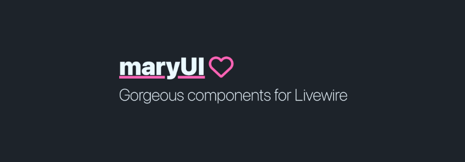

<p align="center">
    
</p>

<p align="center">
  :point_right: <strong><a href="https://mary-ui.com">https://mary-ui.com</a></strong>
</p>

<br><br>

# Contributing to docs

## Install

- Clone the repositoy `git clone git@github.com:robsontenorio/mary-ui.com.git`

- Open it on VSCODE with `Dev Container` extension.

- Create a `.env` from `.env.example`, then adjust some vars on `.env`.

```bash
APP_ENV=local
APP_DEBUG=true
```

- Install, migrate and start.

```bash
composer start
```

**Done! See http://localhost:8018**

<br>

> :warning: If you are not using Docker, use http://localhost or any local address you set up.

> :warning: It uses SQLITE for dynamic examples.